# Main.py Daily Trading Workflow

> **Note (2026-04-01):** main.py now runs a single daily cycle then exits. It is launched
> each weekday morning by Windows Task Scheduler (`scheduled_tasks/start_main.bat`).
> The endless loop and "wait until next trading day" sleep logic have been removed.
> Holiday detection is handled by `is_trading_day()` at startup — if it's a holiday,
> the process exits immediately. Some step names in the flowchart below are outdated
> (e.g., "OID" is now "Option Pipeline", news is inline with FM, not a separate step).

This diagram shows the complete daily orchestration cycle managed by `main.py`.

```mermaid
flowchart TD
    Start([Task Scheduler<br/>Weekday Morning]) --> TradingDay{Is Trading<br/>Day?}
    TradingDay -->|No - Holiday| HolidayExit([Exit — Market Holiday])
    TradingDay -->|Yes| TimeCheck{Current<br/>Time?}

    TimeCheck -->|After 9:15 AM| MidDayRoute[Mid-Day Start<br/>Route to Flow Monitor]
    TimeCheck -->|8:45-9:15 AM| SkipOID[Skip Morning OID<br/>Run Steps 2-4]
    TimeCheck -->|Before 8:45 AM| Step1[Step 1: Morning OID Pipeline<br/>6:35 AM Start]

    Step1 --> Step2
    SkipOID --> Step2

    Step2[Step 2: Earnings Arbitrage Scan<br/>IV Arbitrage Opportunities]
    Step2 --> Break2a[Coffee Break<br/>60 seconds]
    Break2a --> Step3[Step 3: News Collection Pipeline<br/>Gather Symbol News]
    Step3 --> Break3a[Coffee Break<br/>60 seconds]
    Break3a --> Step3_8[Step 3.8: Metadata Collection<br/>25 Stalest Symbols]
    Step3_8 --> Step3_5[Step 3.5: Query DB Sync<br/>Morning Data + Metadata]
    Step3_5 --> Break1[Coffee Break<br/>60 seconds]
    Break1 --> Step4[Step 4: Morning Views<br/>Email Watchlist]

    Step4 --> Step5
    MidDayRoute --> Step5[Step 5: Flow Monitor Pipeline]
    Step5 --> FM_PreMarket[9:15 AM: Pre-Market Setup]
    FM_PreMarket --> FM_Market[9:30 AM: Market Hours<br/>Real-time Monitoring]
    FM_Market --> FM_Close[4:00 PM: Market Close]
    FM_Close --> FM_PostMarket[4:30 PM: Post-Market<br/>Backfill, Regime, Rollup]

    FM_PostMarket --> Break2[Coffee Break<br/>60 seconds]
    Break2 --> Step6[Step 6: Evening OID Pipeline<br/>Volume-Enriched Collection]

    Step6 --> Step6_5[Step 6.5: Query DB Sync<br/>Evening OI + Volume]
    Step6_5 --> Break3[Coffee Break<br/>60 seconds]

    Break3 --> Step7[Step 7: Earnings Alert Pipeline<br/>Process Earnings Events]
    Step7 --> Break4[Coffee Break<br/>60 seconds]

    Break4 --> Step8[Step 8: Airline Play Tracking<br/>Sector Sympathy Analysis]
    Step8 --> Step9_1[Step 9.1: Query DB Sync<br/>Final Complete Dataset]

    Step9_1 --> Break5[Coffee Break<br/>60 seconds<br/>Lock Release]
    Break5 --> Step9_2[Step 9.2: Database Backup - Daily<br/>datalake_backup.db]
    Step9_2 --> FridayCheck{Is<br/>Friday?}

    FridayCheck -->|Yes| Break6[Coffee Break<br/>60 seconds<br/>Lock Release]
    FridayCheck -->|No| Break10[Coffee Break<br/>60 seconds<br/>Prep Batch Mode]

    Break6 --> Step9_3[Step 9.3: Database Backup - Weekly<br/>datalake_backup_weekly.db]
    Step9_3 --> Break7[Coffee Break<br/>60 seconds<br/>Lock Release]
    Break7 --> Step10[Step 10: Earnings Weekly Refresh<br/>Friday Only]
    Step10 --> Break8[Coffee Break<br/>60 seconds<br/>Lock Release]
    Break8 --> Step11[Step 11: Database Archive<br/>Sector-Based 3-Tier Retention]
    Step11 --> Break9a[Coffee Break<br/>60 seconds<br/>Lock Release]
    Break9a --> Step12

    Break10 --> Step12
    Step12[Step 12: Batch Mode Auto-Fix Review<br/>QA on Immediate Fixes]
    Step12 --> Summary

    Summary[Daily Completion Summary<br/>Success/Failure Report]
    Summary --> Done([Exit — Daily Cycle Complete])

    style Start fill:#2d6a4f
    style Step1 fill:#0077b6
    style Step2 fill:#0077b6
    style Step3 fill:#0077b6
    style Step3_8 fill:#0077b6
    style Step4 fill:#0077b6
    style Step5 fill:#0077b6
    style Step6 fill:#0077b6
    style Step7 fill:#0077b6
    style Step8 fill:#0077b6
    style Step9_2 fill:#006d77
    style Step9_3 fill:#006d77
    style Step10 fill:#f48c06
    style Step11 fill:#f48c06
    style Step12 fill:#006d77
    style SkipMorning fill:#f48c06
```

## Daily Timeline (Trading Days)

**Morning Phase (6:35 AM start)**
- 6:35 AM: Morning OID Pipeline (skip if after 8:45 AM)
- Earnings Arbitrage Morning Scan
- News Collection Pipeline
- Metadata Collection Pipeline (25 symbols/day, staleness-based rotation)
- Query DB Sync (Morning data + fresh metadata)
- Morning Views Email (watchlist with fresh metadata)

**Market Phase (9:15 AM - 4:30 PM)**
- 9:15 AM: Flow Monitor Pre-Market Setup
  - Task 0: Alert Resolution (resolve yesterday's flow alerts with fresh OI)
    - Per-alert detail display: contract header, alert-day snapshot, today snapshot
    - Sorted alphabetically, deduped by contract hash
  - Initialize system components
- 9:30 AM: Flow Monitor Market Hours (real-time monitoring)
- 4:00 PM: Flow Monitor Market Close
- 4:30 PM: Flow Monitor Post-Market Analysis

**Evening Phase (After 4:30 PM)**
- Evening OID Pipeline
- Query DB Sync (Evening)
- Earnings Alert Pipeline
- Airline Play Tracking
- Query DB Sync (Final)
- Database Backup (Daily)

**Friday Night Special (Fridays Only)**
- Database Backup (Weekly) - datalake_backup_weekly.db
- Earnings Weekly Refresh
- Database Archive (3-tier sector-based retention)
  - Timeout: 59 hours (Friday 6:30 PM → Monday 5:45 AM cutoff)
  - Tier 1 (15d): flow_options_scans, flow_alerts
  - Tier 2 (30d): option_contracts, option_symbol_summary, flow_symbol_summary
  - Tier 3 (90d): historical_prices, earnings_events, news_*, market_*

**Weeknight Close (All Days)**
- Batch Mode Auto-Fix Review (runs after archive on Friday, ~7:30 PM on M-Th)
- Note: 60-second pauses throughout Friday sequence for safe interruption

**Process Exit**
- Daily cycle complete — process exits, window stays open (`cmd /k`)
- Task Scheduler launches a fresh instance next weekday morning

## Key Decision Points

1. **Trading Day Check**: Uses Tradier market calendar at startup to skip holidays
2. **Timing Router**: Determines start point based on current time
   - Before 8:45 AM → Run from Phase 1 (full morning sequence)
   - 8:45 AM - 9:00 AM → Skip Step 1.1 (Option Pipeline), run Steps 1.2-1.5
   - After 9:00 AM → Skip to Phase 2 (Flow Monitor)
3. **Friday Check**: Triggers weekly backup, earnings refresh, and archive operations
4. **Archive Timeout**: 59-hour window for sector-based archive to complete

## Coffee Breaks (Synchronization Pauses)

**All breaks standardized to 60 seconds** for:
- Database lock release (WAL checkpoint, file handle cleanup)
- Ctrl+C intervention opportunities
- Process separation and breathing room
- Visual segmentation in logs

Breaks occur:
- Between all major steps (morning, evening, Friday operations)
- Before morning views, backups, earnings refresh, archive, batch mode
- Throughout the entire daily cycle for consistency

## Error Handling

- **Critical Errors**: Trigger immediate autofix spawn for recovery
- **Flow Monitor Failure**: Logs warning, continues to evening OID
- **Evening OID Failure**: Continues to sync and backup operations
- **Weekly Backup Failure** (Friday): System continues to earnings refresh and archive
- **Archive Failure** (Friday): System continues, but partial data retention
- **All Errors**: Logged to autofix error queue for immediate/batch mode processing

## Success Metrics

System tracks success rate across 6 operations:
1. Morning OID
2. Flow Monitor
3. Evening OID
4. Daily Backup
5. Archive Operations (Friday only)
6. Weekly Backup (Friday only)

**Perfect Execution**: 6/6 operations successful
**Partial Success**: < 6/6 with detailed failure breakdown
