# Autofix System Workflow

This diagram shows the complete workflow of the Autofix system from error detection through fixing and documentation.

```mermaid
flowchart TD
    Start([Production Error Occurs]) --> Queue[Queue Error<br/>autofix/errors/errors_YYYY-MM-DD.json]

    Queue --> Severity{Error<br/>Severity?}

    Severity -->|CRITICAL| Immediate[Immediate Mode<br/>main_fix_launcher.py]
    Severity -->|Non-Critical| WaitQueue[Written to Error Queue<br/>autofix/errors/errors_YYYY-MM-DD.json]

    Immediate --> RateCheck{Rate Limit<br/>Check}
    WaitQueue --> WaitForBatch[Wait for Daily Cycle<br/>Batch Mode runs ~7:30 PM weekdays<br/>~10:00 PM Fridays]
    WaitForBatch --> BatchTime[Batch Mode Scheduled Trigger<br/>main.py Step 7.6]
    BatchTime --> BatchDedup[Deduplicate Errors<br/>Group by error_type]
    BatchDedup --> BatchSpawn[Spawn One Session Per Error<br/>batch_mode_spawner.py]

    RateCheck -->|< 5/hour| EscCheck{Escalation<br/>Check}
    RateCheck -->|≥ 5/hour| Block1[❌ BLOCKED<br/>Wait 1 hour]

    EscCheck -->|< 3 attempts/day| BuildPrompt[Build Diagnostic Prompt<br/>+ Context Files]
    EscCheck -->|≥ 3 attempts| Escalate[🚨 ESCALATE<br/>Email Human]

    BuildPrompt --> SavePrompt[Save to<br/>autofix/logs/immediate_prompt_*.txt]
    SavePrompt --> SpawnClaude[Spawn Claude Code<br/>New Windows Terminal]

    BatchSpawn --> SpawnBatch[Spawn Claude Code<br/>Batch Mode Session]

    SpawnClaude --> ClaudeSession[Claude Code Session]
    SpawnBatch --> ClaudeSession

    ClaudeSession --> ReadInstructions[Read AUTO_FIX_INSTRUCTIONS.md]
    ReadInstructions --> CheckJournal{Journal<br/>Exists?}

    CheckJournal -->|Yes| ReadJournal[Read Previous Attempts<br/>auto_fix_journal_*.md]
    CheckJournal -->|No| FirstAttempt[First Attempt Today]

    ReadJournal --> Diagnose[Diagnose Root Cause<br/>Read logs, context, code]
    FirstAttempt --> Diagnose

    Diagnose --> FixStrategy{Can Fix<br/>Now?}

    FixStrategy -->|Yes| Backup[Create Backup<br/>*.autofix_backup_*.py]
    FixStrategy -->|No| AddDiag[Add Diagnostic Logging<br/>For Next Spawn]

    Backup --> EditCode[Edit Code<br/>Fix Root Cause]
    EditCode --> TestFix[Test Fix]
    AddDiag --> TestFix

    TestFix --> CheckMainPy{main.py<br/>Running?}

    CheckMainPy -->|Yes - PID Provided| CheckOps{Critical<br/>Operation?}
    CheckMainPy -->|No - Manual Mode| SkipRestart[Skip Restart<br/>User Handling Execution]

    CheckOps -->|Archive/Backup| SkipTest[Skip Testing<br/>Document Fix Only]
    CheckOps -->|Normal| KillProcess[Kill Process<br/>taskkill /PID /F]

    KillProcess --> RestartMain[Restart main.py<br/>start python main.py]
    RestartMain --> Monitor[Monitor 60 Seconds<br/>Check for Crash]

    SkipRestart --> DocumentManual[Update Journal Only<br/>Manual Mode]
    DocumentManual --> ExitManual([Exit - No Email<br/>User Actively Developing])

    Monitor --> Document[Update Journal<br/>+ Create Report]
    SkipTest --> Document

    Document --> Email[Send Email Report<br/>tools/email_notifier.py<br/>Production Mode Only]

    Email --> CriticalCheck{CRITICAL<br/>Error?}

    CriticalCheck -->|Yes| MarkFixed[Mark Error Fixed<br/>mark_error_fixed]
    CriticalCheck -->|No| Done

    MarkFixed --> CreateMarker[Create Completion Marker<br/>.batch_complete_marker]
    CreateMarker --> Done([Exit Session])

    Done -.->|Error Recurs| Queue
    Done -.->|Batch Review| BatchReview[Batch Mode Review<br/>QA on Immediate Fixes]

    Block1 -.->|After Wait| Queue

    style Start fill:#dc2f02
    style Escalate fill:#dc2f02
    style Block1 fill:#f48c06
    style SpawnClaude fill:#2d6a4f
    style SpawnBatch fill:#2d6a4f
    style ClaudeSession fill:#0077b6
    style Email fill:#006d77
    style Done fill:#118ab2
    style ExitManual fill:#457b9d
    style DocumentManual fill:#457b9d
    style WaitQueue fill:#6a4c93
    style WaitForBatch fill:#6a4c93
    style BatchTime fill:#6a4c93
    style BatchDedup fill:#6a4c93
    style BatchSpawn fill:#2d6a4f
```

## Batch Mode Process (Non-Critical Errors)

**When non-critical errors occur:**
1. **Immediate**: Error written to `autofix/errors/errors_YYYY-MM-DD.json`
2. **Wait**: Error sits in queue until scheduled batch mode run
3. **Scheduled Trigger**: main.py Step 7.6 (~7:30 PM weekdays, ~10:00 PM Fridays)
4. **Deduplication**: Errors grouped by `error_type` (spawn once per unique error)
5. **Sequential Processing**: One Claude Code session spawned per unique error
6. **Context**: Each session gets full day context + 30-day historical pattern analysis

**Why batch mode?**
- Non-critical errors can wait until end of day
- Deduplication prevents redundant fixes (100 identical errors → 1 fix session)
- More context available (full day of data vs. single occurrence)
- System remains stable during trading hours

## Key Decision Points

1. **Severity Check**: CRITICAL errors spawn immediately, non-critical wait for batch mode
2. **Rate Limit**: Maximum 5 spawns per hour system-wide (immediate mode only)
3. **Escalation**: Maximum 3 attempts per error type per day before human notification
4. **Fix Strategy**: If root cause unclear, add diagnostics instead of attempting a fix
5. **Critical Operations**: Never kill main.py during archive/backup operations

## Restart Behavior

**main.py is self-healing and workflow-aware:**
- Always restart with `start python main.py` (no arguments needed)
- System automatically resumes at the correct point in the daily cycle
- No component-specific flags required (`--flow-monitor`, `--oid-morning`, etc.)
- Designed for frequent start/stop during development and production

**Manual Mode (main.py NOT running):**
- If error came from standalone script (ei_main.py, op_main.py run directly)
- Autofix fixes the code but does NOT restart anything
- User is handling execution manually - respects manual development workflow
- Agent note: "Fix applied. No restart needed - main.py was not running (manual execution mode)"

## Execution Modes

**Production Mode (PID provided - main.py was running):**
- Full workflow: Fix → Kill → Restart → Monitor → Document → Email
- Autofix manages the entire cycle autonomously
- Email notification sent to alert user of fix

**Manual Mode (No PID - main.py NOT running):**
- Simplified workflow: Fix → Document Journal → Exit
- No restart, no detailed report, no email
- User is actively developing - they'll see the fix themselves
- Respects manual development workflow

## Error Flow States

- **Pending** → Error queued, waiting for processing
- **In Progress** → Claude Code session active
- **Fixed** → Fix applied and marked in error queue
- **Escalated** → Exceeded attempt limit, human notified

## Files Created During Workflow

**Both Modes:**
- `autofix/errors/errors_YYYY-MM-DD.json` - Daily error queue
- `autofix/logs/auto_fix_journal_*.md` - Daily journal of attempts (always created)
- `*.autofix_backup_*.py` - Code backups before edits

**Immediate Mode Only:**
- `autofix/logs/immediate_prompt_*.txt` - Prompts for immediate mode spawns
- `autofix/logs/autofix_launches.json` - Session tracking log

**Production Mode Only:**
- `logs/claude_fixes_*.md` - Detailed fix reports (skipped in manual mode)
- Email notification sent via email_notifier.py (skipped in manual mode)

**Batch Mode Only:**
- `autofix/logs/batch_prompt_YYYY-MM-DD_NN.txt` - Batch mode prompts (sequential numbering)
- `autofix/logs/.batch_complete_YYYY-MM-DD_NN.marker` - Completion markers (sequential)
- `autofix/context/batch_context_YYYY-MM-DD.json` - Error context with 30-day history
- `autofix/logs/batch_review_YYYY-MM-DD.md` - QA review journals (when reviewing immediate mode fixes)