# Database Health Operations Workflows

This document shows the complete database health, backup, sync, and archive operations that run throughout the daily cycle.

**Last Updated:** 2026-05-16 (P028 — tier retention rework)

> **Canonical archive tier policy:** the authoritative source is the `TIER_POLICIES` dict and module docstring at the top of `data/health/db_archive_sector.py`. This doc mirrors that policy for operational context; when in doubt, trust the script.

```mermaid
flowchart TD
    Start([Daily Cycle]) --> Morning[Morning After OID<br/>~8:00 AM]

    Morning --> Sync1[Query DB Sync #1<br/>db_backup.py --sync --auto]
    Sync1 --> SyncOp1[Copy datalake.db<br/>→ datalake_query.db]
    SyncOp1 --> Sync1Check{Sync<br/>Success?}

    Sync1Check -->|Failed| Sync1Error[ERROR - Stale Query DB<br/>Continue anyway]
    Sync1Check -->|Success| Sync1Done[~14 minutes<br/>Query DB fresh]

    Sync1Error --> MorningViews
    Sync1Done --> MorningViews[Morning Views Generation<br/>CRITICAL: Must run AFTER sync]

    MorningViews --> FlowMonitor[Flow Monitor Runs<br/>9:30 AM - 4:00 PM]
    FlowMonitor --> Evening[Evening After OID<br/>~5:30 PM]

    Evening --> Sync2[Query DB Sync #2<br/>db_backup.py --sync --auto]
    Sync2 --> SyncOp2[Copy datalake.db<br/>→ datalake_query.db]
    SyncOp2 --> Sync2Done[~14 minutes<br/>Complete OI + Volume]

    Sync2Done --> EarningsPhase[Earnings Intel<br/>Airline Play]
    EarningsPhase --> Sync3[Query DB Sync #3 Final<br/>db_backup.py --sync --auto]

    Sync3 --> SyncOp3[Copy datalake.db<br/>→ datalake_query.db]
    SyncOp3 --> Sync3Done[~14 minutes<br/>Final dataset complete]

    Sync3Done --> CoffeeBreak1[Coffee Break<br/>60 seconds<br/>Wait for lock release]
    CoffeeBreak1 --> Backup[Daily Backup<br/>db_backup.py]

    Backup --> BackupOp[Copy datalake.db<br/>→ datalake_backup.db]
    BackupOp --> BackupDone[Daily backup<br/>Overwrites yesterday]

    BackupDone --> LogAnalyzer[Log Analyzer<br/>Step 7.5]
    LogAnalyzer --> FridayCheck{Is<br/>Friday?}

    FridayCheck -->|No - Weekday| BatchMode[Batch Mode Review<br/>~7:30 PM weekdays]
    FridayCheck -->|Yes - Friday| Wait10PM[Wait Until 10:00 PM<br/>Archive should complete]

    Wait10PM --> FridayBatch[Batch Mode Review<br/>~10:00 PM Friday]
    FridayBatch --> FridayEarnings[Earnings Weekly Refresh<br/>Friday only]

    FridayEarnings --> Archive[Database Archive<br/>db_archive_sector.py]

    Archive --> ArchiveInit[Initialize Archive<br/>59-hour timeout window]
    ArchiveInit --> Tier1[Tier 1: 7-day MOVE<br/>flow_options_scans, flow_alerts]

    Tier1 --> Tier1Route[Route by Symbol Sector<br/>→ sector_archive/airlines.db<br/>→ sector_archive/technology.db<br/>etc.]
    Tier1Route --> Tier1Mode{Copy or<br/>Move?}

    Tier1Mode -->|flow_alerts: COPY| Tier1Copy[INSERT to archive<br/>Keep in production]
    Tier1Mode -->|flow_options_scans: MOVE| Tier1Move[INSERT to archive<br/>DELETE from production]

    Tier1Copy --> Tier2
    Tier1Move --> Tier2[Tier 2: 30-day MOVE<br/>option_contracts only]

    Tier2 --> Tier2Route[Route by Symbol Sector<br/>1 table, hybrid logic]
    Tier2Route --> Tier2Hybrid{option_contracts<br/>Hybrid?}

    Tier2Hybrid -->|Expired OR Old| Tier2Archive[Archive expired contracts<br/>OR trade_date > 30d]
    Tier2Hybrid -->|Keep| Tier3[Tier 3: COPY mode<br/>90d default + 300d per-table override<br/>for summary tables]

    Tier2Archive --> Tier3

    Tier3 --> Tier3Route[Route Reference Data<br/>prices, earnings, news, market]
    Tier3Route --> Tier3Special{Routing<br/>Type?}

    Tier3Special -->|Symbol-based| Tier3Symbol[Route to symbol sectors]
    Tier3Special -->|All Sectors| Tier3All[Copy to EVERY sector archive<br/>market_daily_summary]
    Tier3Special -->|Multi-symbol| Tier3Multi[Parse JSON, route to multiple<br/>news_articles]

    Tier3Symbol --> ArchiveTimeout
    Tier3All --> ArchiveTimeout
    Tier3Multi --> ArchiveTimeout[Timeout Check<br/>59 hours max]

    ArchiveTimeout --> TimeoutCheck{Time<br/>Exceeded?}

    TimeoutCheck -->|Yes - Mon 5:45 AM| ArchiveAbort[Archive Incomplete<br/>Graceful shutdown]
    TimeoutCheck -->|No| ArchiveComplete{Archive<br/>Complete?}

    ArchiveComplete -->|Failed| ArchiveFailed[Archive Failed<br/>Skip weekly backup]
    ArchiveComplete -->|Success| WeeklyBackup[Weekly Backup<br/>Copy daily → weekly]

    ArchiveFailed --> Done
    ArchiveAbort --> Done

    WeeklyBackup --> WeeklyOp[Copy datalake_backup.db<br/>→ datalake_backup_weekly.db]
    WeeklyOp --> WeeklyDone[Weekly backup complete<br/>Preserved until next Friday]

    WeeklyDone --> Done([Daily Cycle Complete])

    BatchMode --> NextDay([Continue to Next Day])

    style Start fill:#2d6a4f
    style Sync1 fill:#0077b6
    style Sync2 fill:#0077b6
    style Sync3 fill:#0077b6
    style Backup fill:#006d77
    style Archive fill:#6a4c93
    style WeeklyBackup fill:#006d77
    style Tier1 fill:#457b9d
    style Tier2 fill:#457b9d
    style Tier3 fill:#457b9d
    style Sync1Error fill:#f48c06
    style ArchiveFailed fill:#dc2f02
    style ArchiveAbort fill:#f48c06
    style Done fill:#2d6a4f
    style NextDay fill:#2d6a4f
```



## Database Files in the System

### Production Database
- **datalake.db**: Primary production database
  - Written to by data collection pipelines
  - Never query during collection windows (6:30-8:00 AM, 4:30-6:00 PM)
  - Size: ~2-4 GB (varies with retention)

### Query Database
- **datalake_query.db**: Read-only analysis database
  - Synced 3x daily from datalake.db
  - Safe to query anytime (no locking conflicts)
  - Used by: Claude Code, analysis tools, Morning Views

### Backup Files
- **datalake_backup.db**: Daily backup (overwrites previous day)
  - Created after all data collection complete (~7:15 PM)
  - Provides recovery point from yesterday

- **datalake_backup_weekly.db**: Weekly backup (Friday nights)
  - Created after Friday archive completes (~11:00 PM)
  - Preserved until next Friday
  - Provides week-end recovery point

### Archive Files
- **sector_archive/{sector}.db**: Sector-specific archives
  - Sectors: airlines, technology, financial, energy, healthcare, etc.
  - Three-tier retention (7d / 30d / 90d default + 300d override for summary tables)
  - Created Friday nights, updated incrementally

## Workflow Details

### 1. Query Database Sync (3x Daily)

**Schedule:**
- **Sync #1**: ~8:00 AM (after morning OID)
- **Sync #2**: ~5:30 PM (after evening OID)
- **Sync #3**: ~6:15 PM (after earnings/airline, final complete dataset)

**Process:**
```bash
python data/health/db_backup.py --sync --auto
```

**Duration:** ~14 minutes (typical database size)

**Method:**
1. Open datalake.db (source)
2. Open/create datalake_query.db (target)
3. SQLite backup API (native, atomic)
4. Progress tracking (pages copied)
5. Verify completion

**Critical Timing:**
- **Morning Views MUST run AFTER Sync #1**
  - Morning Views creates SQL views in datalake_query.db
  - If sync runs after, views are destroyed
  - Current order in main.py: Sync → Morning Views ✅

**Error Handling:**
- Sync failure → ERROR (batch mode)
- System continues, but query DB has stale data
- Analysis tools may see incomplete data

---

### 2. Daily Backup (Every Day ~7:15 PM)

**Schedule:** After all data collection, before log analyzer

**Process:**
```bash
python data/health/db_backup.py
```

**Method:**
1. Copy datalake.db → datalake_backup.db
2. Overwrites previous day's backup
3. Uses SQLite backup API
4. ~5-10 minutes duration

**Purpose:**
- Disaster recovery (restore from yesterday)
- Quick recovery point before archive operations

---

### 3. Friday Archive (Fridays Only, ~8:45 PM start)

**Schedule:** Friday nights after Earnings Weekly Refresh

**Process:**
```bash
python data/health/db_archive_sector.py --all-tiers
```

**Timeout Window:** 59 hours
- **Start**: Friday 6:30 PM
- **Cutoff**: Monday 5:45 AM
- **Purpose**: Allow archive to run over weekend without blocking Monday operations

**Three-Tier Retention Strategy** (canonical: `db_archive_sector.py` `TIER_POLICIES` dict, ~line 282):

#### Tier 1 (7-day retention, MOVE default)
**Tables:**
- `flow_options_scans` (MOVE — delete from production after archive)
- `flow_alerts` (table-level `mode='copy'` override — kept in production)

**Routing:** By symbol sector via `symbol_metadata.archive_db`
**Cutoff:** Data older than 7 days

**Why 7d:** P028 (2026-05-15) cut from 15d→7d after FM baseline generator was decoupled from raw scan retention via `flow_daily_aggregates` pre-materialization. TA confirmed never needing more than 2-day raw scan lookback.

**Special Case — flow_alerts:**
- Table-level `mode='copy'` override skips the tier1 DELETE pass
- Reason: Keep alerts in production for performance tracking, profitability resolution
- Still archived to sectors for historical analysis

#### Tier 2 (30-day retention, MOVE)
**Tables:**
- `option_contracts` (MOVE — with hybrid strategy)

**Note:** Summary tables `option_symbol_summary` and `flow_symbol_summary` were migrated from Tier 2 to Tier 3 with 300-day retention override in P028.

**Routing:** By symbol sector
**Cutoff:** Data older than 30 days (with hybrid override)

**Hybrid Strategy — option_contracts:**
- Archive if: `expired OR trade_date > 30 days`
- Keeps unexpired contracts longer
- Contracts expiring in 60+ days stay in production even if 35 days old

#### Tier 3 (90-day default, COPY mode, with per-table retention_days_override)
**Tables (90-day default retention):**
- `historical_prices` (COPY — `skip_cleanup: True`, retained indefinitely in production)
- `earnings_events` (COPY — `skip_cleanup: True`, retained indefinitely in production)
- `news_symbol_sentiment` (COPY)
- `news_articles` (COPY — multi-sector routing)
- `market_daily_summary` (COPY — all sectors)

**Tables with `retention_days_override: 300` (P028 additions):**
- `option_symbol_summary` (COPY, 300d) — migrated from Tier 2
- `flow_symbol_summary` (COPY, 300d) — migrated from Tier 2
- `flow_daily_aggregates` (COPY, 300d) — new table backing FM baseline generation

**Routing Strategies:**
- **Symbol-based**: Route to one sector per symbol
- **All sectors**: Copy to EVERY sector archive (`market_daily_summary`)
- **Multi-symbol**: Parse JSON array, route to multiple sectors (`news_articles`)

**COPY Mode:**
- Data inserted into archives
- Data remains in production until the per-table retention cutoff
- `cleanup_tier3_production` deletes rows older than each table's effective retention
- `skip_cleanup: True` short-circuits cleanup for reference tables that must remain in production

**Per-table retention_days_override plumbing (P028, 5 sites in `db_archive_sector.py`):**
- Tier1/2/3 dispatchers each call `table_config.get('retention_days_override', tier_config['retention_days'])`
- `cleanup_tier3_production` reads the override per-iteration inside the per-table loop (after the `skip_cleanup` short-circuit)
- `analyze_archive_impact` (dry-run) uses the override for cutoff calculation while keeping tier-level retention_days for the banner/stats header

**Sector Routing Logic:**
```
Symbol → Sector Mapping (from symbol_metadata table)
DAL → airlines → data/sector_archive/airlines.db
AAPL → technology → data/sector_archive/technology.db
BAC → financial → data/sector_archive/financial.db
...
```

**Process Flow:**
1. Initialize timeout (59 hours)
2. For each tier (1, 2, 3):
   - For each table in tier:
     - Query production for old data
     - Get symbol sector from symbol_metadata
     - Open/create sector archive DB
     - Copy/move data to archive
     - If MOVE mode: Delete from production
3. Check timeout after each batch
4. Graceful shutdown if timeout exceeded

**Completion:**
- Normal: All tiers complete, return success
- Timeout: Partial completion, return success with warning
- Error: Return failure, skip weekly backup

---

### 4. Weekly Backup (Friday After Archive)

**Schedule:** Friday ~11:00 PM (after archive completes)

**Process:**
```bash
# In main.py, copies the daily backup
cp data/datalake_backup.db data/datalake_backup_weekly.db
```

**Prerequisites:**
- Daily backup must exist
- Archive must have succeeded (or at least not failed critically)

**Purpose:**
- Week-end recovery point
- Preserved for 7 days (until next Friday)
- Useful if archive operation corrupted something

**Error Handling:**
- If archive failed → Skip weekly backup
- If daily backup missing → Skip weekly backup

---

## Critical Timing Dependencies

### 1. Morning Views Dependency
```
Morning OID → Query Sync #1 → Morning Views
                ↑
                MUST happen in this order!
```

**Why:**
- Morning Views creates SQL views in datalake_query.db
- Views reference tables in that database
- If sync runs after, it overwrites the DB and destroys the views

**Current Protection:** Main.py enforces correct order

---

### 2. Friday Archive Window
```
Friday 6:30 PM: Archive starts
...
Saturday - Sunday: Archive continues
...
Monday 5:45 AM: Archive MUST complete or abort
Monday 6:35 AM: Morning OID must run
```

**Why 59 hours:**
- Allows full weekend for archive
- Ensures completion before Monday morning pipeline
- Prevents blocking Monday data collection

**Graceful Shutdown:**
- Archive checks timeout after each batch
- If exceeded: completes current operation, saves progress, exits
- Next Friday: continues from where it left off

---

### 3. Batch Mode Wait
```
Friday Evening:
7:30 PM: Log Analyzer
8:00 PM: Wait until 10:00 PM (archive should be done)
10:00 PM: Batch Mode Review (safe to proceed)
8:30 PM: Earnings Weekly Refresh
8:45 PM: Archive starts (long-running)
```

**Why wait:**
- Batch mode spawns Claude Code sessions
- Archive is long-running, resource-intensive
- Don't want concurrent heavy operations

---

## Recovery Scenarios

### Scenario 1: Lost Recent Data
**Problem:** Corrupted production database, lost today's data
**Solution:** Restore from `datalake_backup.db` (yesterday's data)
**Impact:** Lose 1 day of data, re-run pipelines

### Scenario 2: Week-Long Issue
**Problem:** Corruption discovered on Friday, entire week suspect
**Solution:** Restore from `datalake_backup_weekly.db` (last Friday)
**Impact:** Lose 1 week of data, major re-processing needed

### Scenario 3: Historical Data Analysis
**Problem:** Need to analyze airline sector data from 2 months ago
**Solution:** Query `data/sector_archive/airlines.db`
**Impact:** None - archived data available

### Scenario 4: Archive Failed
**Problem:** Friday archive crashed, incomplete
**Solution:**
- Don't panic - production data still intact (COPY mode for Tier 3)
- Re-run archive next Friday (will catch up)
- Or manually run: `python data/health/db_archive_sector.py --all-tiers`
**Impact:** Production DB slightly larger, performance may degrade

---

## Database Operations Summary

### Tables Read
- **symbol_metadata**: For sector routing during archive

### Tables Written/Modified

**Query Sync:**
- All tables in datalake_query.db (complete replacement)

**Archive (to sector archives):**
- **Tier 1** (7d): flow_options_scans, flow_alerts
- **Tier 2** (30d): option_contracts (hybrid expired-OR-old)
- **Tier 3** (90d default): historical_prices, earnings_events, news_*, market_daily_summary
- **Tier 3** (300d override): option_symbol_summary, flow_symbol_summary, flow_daily_aggregates

**Production DELETE (MOVE mode only, or COPY tier3 cleanup):**
- **Tier 1**: flow_options_scans (flow_alerts kept via mode='copy' override)
- **Tier 2**: option_contracts (hybrid logic)
- **Tier 3**: All except `historical_prices` and `earnings_events` (both have `skip_cleanup: True`). Summary tables and `flow_daily_aggregates` cleanup at 300d; news/market_daily_summary at 90d.

---

## Performance Characteristics

**Query Sync:**
- Duration: ~14 minutes
- I/O: Sequential read + write
- Database size: ~2-4 GB
- CPU: Low (I/O bound)

**Daily Backup:**
- Duration: ~5-10 minutes
- I/O: Sequential copy
- Method: SQLite backup API
- CPU: Low

**Friday Archive:**
- Duration: Hours to 59 hours
- I/O: Heavy (read production, write multiple archives)
- CPU: Moderate (sector routing, SQL queries)
- Disk: Writes to 10+ sector archive files
- Network: None (all local)

**Weekly Backup:**
- Duration: ~2 minutes
- I/O: File copy (backup → weekly backup)
- CPU: Minimal

---

## Error Handling

### Query Sync Failures
**Severity:** ERROR (batch mode)
**Behavior:** Continue pipeline, query DB has stale data
**Impact:** Analysis tools may show incomplete/old data
**Recovery:** Automatic on next sync

### Daily Backup Failures
**Severity:** ERROR (batch mode)
**Behavior:** Continue pipeline
**Impact:** No recovery point for today
**Recovery:** Backup tomorrow, or restore from weekly

### Archive Failures
**Severity:** Depends on failure type
**Behavior:**
- Schema error → CRITICAL (spawn Autofix)
- Timeout → Graceful shutdown, continue next week
- Data error → ERROR (batch mode)
**Impact:** Production DB retains data (degrades performance over time)
**Recovery:** Re-run archive manually or wait until next Friday

### Weekly Backup Failures
**Severity:** ERROR (batch mode)
**Behavior:** Continue to next day
**Impact:** No week-end recovery point
**Recovery:** Backup next Friday

---

## Related Documentation
- **Main orchestration**: See `MAIN_DAILY_WORKFLOW.md` for daily cycle integration
- **Autofix integration**: See `autofix/AUTOFIX_WORKFLOW.md` for error handling
- **Sector archive design**: See `data/sector_archive/README.md`
- **Database schema**: See `data/datalake_schema_2025-10-16.md`
