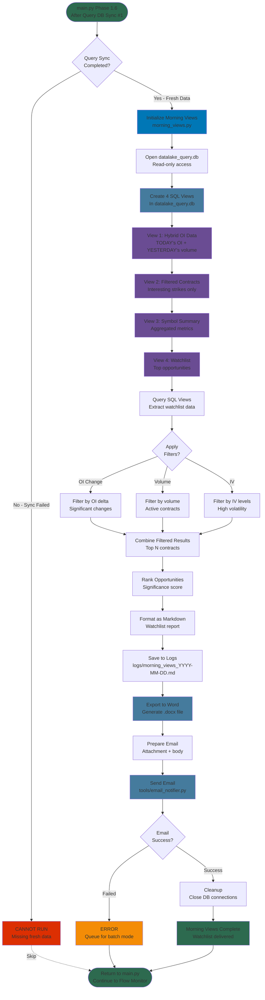

# Morning Views Workflow

> **Historical (2026-08-31):** The emailed-watchlist workflow this document describes was removed. `morning_views.py` now only owns the TUI view schema (user_watchlist table + the 5 SQL views); the view-creation sections below still reflect how those views work.

This diagram shows the Morning Views generation process that creates and emails the daily options watchlist.

**Last Updated:** 2025-11-17



## Workflow Overview

**Purpose:** Generate and email a daily options watchlist based on overnight OI changes

**Schedule:** ~8:00 AM (Phase 1.6 in daily cycle)

**Duration:** ~2-5 minutes

**Prerequisites:**
- ✅ Morning OID Pipeline completed (TODAY's OI data collected)
- ✅ Query DB Sync #1 completed (datalake_query.db updated)

**Output:**
- Markdown log file with full analysis
- .docx Word document with formatted watchlist
- Email with attachment to user

---

## Critical Timing Dependency

### ⚠️ MUST Run AFTER Query Sync #1

**Correct Order:**
```
Morning OID → Query Sync #1 → Morning Views ✅
```

**Why This Matters:**
1. Morning Views **creates SQL views** in datalake_query.db
2. Views are database objects (like tables) stored in the .db file
3. Query Sync **overwrites the entire datalake_query.db** file
4. If sync runs after Morning Views → **views are destroyed** 💥

**Current Protection:** main.py enforces correct order in Phase 1 sequence

**What Happens If Order Wrong:**
```
Morning Views → Query Sync #1 ❌
     ↓               ↓
Creates views   Overwrites DB
     ↓               ↓
   Views exist   Views gone!
                     ↓
            Morning Views fails
            (views don't exist)
```

---

## The 4 SQL Views

Morning Views creates 4 temporary SQL views in datalake_query.db:

### View 1: Hybrid OI Data
```sql
-- Combines TODAY's OI with YESTERDAY's context
SELECT
    TODAY.symbol,
    TODAY.strike,
    TODAY.open_interest as oi_today,
    YESTERDAY.volume as volume_yesterday,
    YESTERDAY.delta as delta_yesterday,
    YESTERDAY.last_price as price_yesterday
FROM option_contracts TODAY
LEFT JOIN option_contracts YESTERDAY
    ON TODAY.symbol = YESTERDAY.symbol
    AND YESTERDAY.trade_date = DATE(TODAY.trade_date, '-1 day')
```

**Why Hybrid:**
- TODAY (current trade_date): Has fresh OI, but no volume yet (market hasn't opened)
- YESTERDAY (trade_date - 1): Has volume/Greeks/price from yesterday's trading
- Combine them: Get overnight OI changes + yesterday's trading context

### View 2: Filtered Contracts
```sql
-- Filter to interesting strikes only
SELECT * FROM hybrid_oi_data
WHERE
    ABS(oi_today - oi_yesterday) > threshold
    OR volume_yesterday > volume_threshold
    OR iv_rank > 50
```

**Filtering Criteria:**
- Significant OI change (absolute or percentage)
- High volume yesterday
- High IV rank
- Within ±20% strike range (from underlying price)

### View 3: Symbol Summary
```sql
-- Aggregate to symbol level
SELECT
    symbol,
    COUNT(*) as interesting_contracts,
    SUM(oi_change) as total_oi_change,
    MAX(significance_score) as max_score
FROM filtered_contracts
GROUP BY symbol
```

**Purpose:** Show which symbols have the most interesting activity

### View 4: Watchlist
```sql
-- Top N opportunities
SELECT * FROM symbol_summary
ORDER BY max_score DESC
LIMIT 50
```

**Final Output:** Top 50 symbols ranked by significance

---

## Data Flow

**Input Data Sources:**
1. **option_contracts** (from datalake_query.db)
   - TODAY's data: Fresh OI from morning collection
   - YESTERDAY's data: Volume, Greeks, price context

2. **option_symbol_summary** (from datalake_query.db)
   - Symbol-level IV metrics
   - Max pain, Greek exposures

3. **historical_prices** (from datalake_query.db)
   - Current stock prices
   - For moneyness calculations

**Processing Steps:**
1. Create SQL views (hybrid data)
2. Query views to extract opportunities
3. Filter by criteria (OI change, volume, IV)
4. Rank by significance score
5. Format as markdown report
6. Export to .docx Word document
7. Email with attachment

**Output Files:**
- `logs/morning_views_YYYY-MM-DD.md` - Full analysis log
- `morning_views_YYYY-MM-DD.docx` - Formatted watchlist (temporary)
- Email to user with .docx attachment

---

## Watchlist Content

**Typical Watchlist Includes:**

**For Each Symbol:**
- Symbol name
- Current price
- Number of interesting contracts
- Total OI change (sum across all contracts)
- Max significance score
- Top 3-5 specific contracts with:
  - Strike price
  - Expiration date
  - Call/Put
  - OI change (overnight)
  - Volume yesterday
  - Delta, IV (from yesterday)

**Example Entry:**
```
NVDA - $485.32
  Interesting Contracts: 8
  Total OI Change: +12,450 contracts
  Max Score: 8.5

  Top Contracts:
  1. $500 Call, Nov 15 - OI: +3,200 (+45%) | Vol: 8,500 | Delta: 0.42
  2. $480 Put, Nov 22 - OI: +2,800 (+62%) | Vol: 4,200 | Delta: -0.38
  3. $490 Call, Nov 15 - OI: +2,100 (+35%) | Vol: 6,100 | Delta: 0.48
```

---

## Filtering Logic

### OI Change Threshold
- **Absolute**: > 500 contracts change
- **Percentage**: > 25% change from yesterday
- **Either condition**: Triggers inclusion

### Volume Threshold
- **Yesterday's volume**: > 1,000 contracts
- **Reason**: Liquid, tradeable options

### IV Rank
- **IV Rank**: > 50th percentile
- **Reason**: Elevated volatility = interesting opportunities

### Strike Range
- **Moneyness**: ±20% from current price
- **Reason**: Focus on tradeable strikes

---

## Email Delivery

**Email Format:**
- **Subject:** "Morning Views - YYYY-MM-DD"
- **Body:**
  - Summary statistics (symbols analyzed, opportunities found)
  - Quick highlights (top 3 symbols)
  - Link to full report (in logs)
- **Attachment:** morning_views_YYYY-MM-DD.docx

**Delivery Method:**
```python
from tools.email_notifier import send_email
send_email(
    subject="Morning Views - {}".format(trade_date),
    body=summary_text,
    attachment=docx_path
)
```

**Error Handling:**
- Email send failure → ERROR (batch mode)
- System continues to Flow Monitor
- User manually checks logs/morning_views_*.md

---

## Performance

**Timing:**
- View creation: ~10 seconds
- Query execution: ~30 seconds (depends on data size)
- Markdown formatting: ~10 seconds
- .docx export: ~30 seconds
- Email send: ~5-10 seconds
- **Total**: ~2-5 minutes

**Database Operations:**
- **Read**: option_contracts, option_symbol_summary, historical_prices
- **Write**: Creates 4 SQL views in datalake_query.db (temporary)
- **Cleanup**: Views destroyed on next query sync (by design)

---

## Error Handling

### Prerequisites Failed
**Problem:** Query Sync #1 failed, datalake_query.db stale
**Behavior:** Morning Views should not run (missing fresh data)
**Current**: main.py continues anyway (non-blocking failure)

### View Creation Failed
**Problem:** SQL syntax error, table missing
**Behavior:** ERROR (batch mode)
**Impact:** No watchlist generated
**Recovery:** Check schema, fix SQL, re-run manually

### Email Send Failed
**Problem:** SMTP error, network issue
**Behavior:** ERROR (batch mode)
**Impact:** No email delivered, but .docx and .md files exist
**Recovery:** User manually checks logs/morning_views_*.md

---

## Integration with Daily Cycle

**Phase 1 Sequence (Morning):**
```
6:35 AM: Morning OID Collection
  ↓
~8:00 AM: Query DB Sync #1
  ↓
~8:15 AM: Morning Views ← YOU ARE HERE
  ↓
9:15 AM: Flow Monitor Pre-Market
```

**Critical Path:**
- Morning OID must complete (fresh OI data)
- Query Sync must complete (datalake_query.db updated)
- Morning Views runs before Flow Monitor starts
- Watchlist ready before market opens (9:30 AM)

---

## Related Documentation
- **Main orchestration**: See `MAIN_DAILY_WORKFLOW.md` for daily cycle
- **Database health**: See `data/health/DATABASE_HEALTH_WORKFLOWS.md` for sync details
- **Option Pipeline**: See `strategies/option_pipeline/OPTION_PIPELINE_WORKFLOW.md` for morning OID
